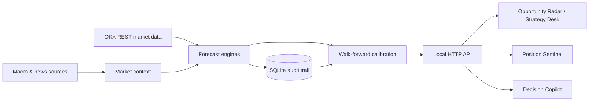

# QIS — OKX Semi-Auto Quant

[English](README.md) | [简体中文](README.zh-CN.md)

[](https://www.python.org/)
[](#testing)
[](#safety-boundaries)
[](https://github.com/xietingwei/okx-semi-auto-quant/commits/main)

**QIS** is a local-first, explainable market research and decision-support
system for OKX spot and perpetual markets. It combines live market data,
multiple short-horizon forecasting strategies, walk-forward evaluation, portfolio-aware risk
controls, and an optional LLM copilot.

The system runs in **paper mode by default**. It analyzes and records decisions;
it does not automatically trade real funds.

> **Disclaimer:** This project is for research and engineering purposes only.
> It is not investment advice. Cryptocurrency and leveraged products can result
> in rapid, substantial losses.

## Why QIS?

Most trading dashboards expose a signal without explaining how it was produced.
QIS keeps the full decision chain visible:

```text
live market data
  → trend, momentum and volatility features
  → market microstructure and global regime
  → multiple independent strategy forecasts
  → historical calibration and model health checks
  → opportunity score and strategy gate
  → manual decision and position monitoring
```

QIS is designed around four principles:

- **Explainable:** every forecast includes factors, probability, target,
  interval, invalidation level, and strategy scope.
- **Risk-first:** low scores, weak validation, stale data, and adverse market
  regimes reduce or block trade readiness.
- **Auditable:** predictions are frozen hourly and evaluated against realized
  prices after their horizon expires.
- **Human-in-the-loop:** the system recommends; the user decides and executes.

## Highlights

| Capability | What it provides |
| --- | --- |
| Opportunity radar | Ranks crypto, external US-stock daily data, and optional OKX stock-mapped instruments using calibrated multi-horizon forecasts |
| Strategy desk | Compares adaptive, trend-following, breakout-confirmation, and mean-reversion models |
| Deep analysis | Reviews up to 180 daily candles when the source has enough history, explains each day with quantitative facts and news context, validates the hypotheses, and summarizes repeatable patterns into a super brain |
| Deep ranking | Ranks all symbols by core deep-analysis hit rate, sample depth, and projection readiness |
| Shadow Neural Brain | Runs a dependency-free neural learner in shadow mode, ranking assets by validated edge without overriding trade decisions |
| Live-price forecasting | Recalculates features, probability, return, and target from the latest OKX ticker |
| Market context | Uses order-book depth, funding, open interest, volume structure, macro data, and market breadth |
| Position sentinel | Suggests dynamic stops, profit protection, reductions, and exit timing for manually registered positions |
| Continuous evaluation | Measures direction accuracy, MAE, bias, Brier score, and interval coverage |
| Decision copilot | Streams context-aware answers through any OpenAI-compatible chat-completions provider |
| Local-first operation | Stores runtime data in local SQLite and serves a local web application |

## Strategy Suite

Each strategy interprets the same market data through a different trading
hypothesis.

| Strategy | Primary horizon | Directional intent | Best suited for | Main failure mode |
| --- | --- | --- | --- | --- |
| Adaptive | 1–14 days | Trend-led, balanced by crowding and market regime | Mixed or transitioning markets | Simultaneous factor failure during shocks |
| Trend following | 3–14 days | Follow the local 7/14/30-day trend | Short directional moves and pullback continuation | Whipsaw in ranges |
| Breakout confirmation | 1–7 days | Follow momentum confirmed by volume, order book, and positioning | Expansion after consolidation | False breakouts |
| Mean reversion | 1–7 days | Trade against statistically excessive displacement | Range-bound markets and post-shock repair | Catching a falling knife in strong trends |

New strategies use isolated model versions and independent evaluation records.

### Short-horizon boundary and evidence gate

The production forecast surface is limited to **1 day, 3 days, 7 days, and 14 days**. Three days is the primary decision horizon, seven days is confirmation, one day is execution timing, and 14 days is risk context only. The system no longer emits point forecasts for one, three, or six months; those horizons are too unstable to be useful trading references.

The opportunity radar requires both clean short-term data and out-of-sample evidence. Duplicate, missing, stale, or insufficient candles cap the opportunity score at 39 and produce an observation-only decision. The 3-day and 7-day horizons also need independent validation windows and an edge over baseline before they become actionable.

Chart ranges (**1D, 1M, 3M, 6M, 1Y, ALL**) describe historical coverage, not forecast horizons. Crypto charts request real OKX intervals such as 5m, 1H, 2H, 4H, 12H, and 1D and merge live plus paginated history. External equities are daily-only; the UI never relabels daily candles as hourly data.
Until enough strategy-specific outcomes mature, they remain marked
**simulation only** and cannot issue a production-ready entry recommendation.

## Forecast Inputs

The active model family currently combines:

- live OKX ticker price;
- Yahoo Finance daily US-stock candles for `QIS_US_STOCK_SYMBOLS`, with the UI showing the exchange and broker/trading venue hint;
- 30/90-day log-price trends;
- 7/30/90-day momentum;
- 60-day realized volatility and ATR;
- 20-level order-book imbalance and spread;
- perpetual funding-rate crowding;
- open-interest change interpreted together with price direction;
- recent signed-volume structure and volume participation;
- SPY, QQQ, USD proxy, VIX, and US 10-year yield context;
- crypto-market breadth, 30-day trend breadth, BTC trend anchor, market
  volatility, and liquidity participation.

All auxiliary factors are bounded. They adjust signal strength but cannot apply
an unrestricted market-wide intercept or silently reverse every instrument.

## Decision Rules

The opportunity score and strategy label are calculated by the same backend
logic after live-price recalculation and historical calibration.

| Score | Maximum strategy state |
| ---: | --- |
| 70–100 | Entry may be considered if probability, confidence, validation, and regime gates also pass |
| 60–69 | Wait for a defined trigger |
| 45–59 | Neutral observation |
| 0–44 | Wait for trend stabilization |

During a risk-contraction regime, otherwise strong instruments are downgraded
to **counter-trend confirmation required** rather than being presented as
ordinary entry candidates.

## Architecture



## Quick Start

### Requirements

- Python 3.10 or newer
- macOS or Linux shell environment
- Internet access to public OKX market endpoints
- Optional: OKX API credentials for private-account checks or execution
- Optional: an OpenAI-compatible LLM API key for the decision copilot

### Run locally

```bash
git clone https://github.com/xietingwei/okx-semi-auto-quant.git
cd okx-semi-auto-quant

cp .env.example .env
bash scripts/start.sh
```

Open:

```text
http://127.0.0.1:8787/
```

Check or stop services:

```bash
bash scripts/status.sh
bash scripts/stop.sh
```

Public market analysis works without OKX credentials. Keep the default
configuration for the safest first run:

```ini
OKX_SIMULATED=1
QIS_MODE=paper
```

## Configuration

Configuration is read from `.env`. Never commit this file.

### OKX

```ini
OKX_API_KEY=
OKX_API_SECRET=
OKX_API_PASSPHRASE=
OKX_SIMULATED=1

QIS_MODE=paper
QIS_SPOT_AUTO_DISCOVER=1
QIS_SPOT_MAX_ASSETS=60
```

### Risk Limits

```ini
QIS_RISK_PER_TRADE=0.0075
QIS_DAILY_LOSS_LIMIT=0.025
QIS_MAX_DRAWDOWN=0.12
QIS_MAX_LEVERAGE=2
QIS_MAX_NOTIONAL_PCT=0.35
QIS_MAX_TRADES_PER_DAY=6
```

### Optional LLM Copilot

QIS uses an OpenAI-compatible `/chat/completions` interface. The model provider
is replaceable and does not participate in numeric forecast generation.

```ini
LLM_PROVIDER=DeepSeek
LLM_API_KEY=
LLM_BASE_URL=https://api.deepseek.com
LLM_MODEL=deepseek-v4-flash
LLM_TIMEOUT_SECONDS=45
```

If the LLM is unavailable, forecasting, evaluation, and risk functions continue
to operate normally.

### Opportunity Email Alerts

QIS can send one aggregated email when a strategy's opportunity score reaches
the configured threshold. Alerts are deduplicated by instrument and strategy,
with a configurable cooldown. Gmail accounts must use an app password.

```ini
QIS_EMAIL_ALERT_ENABLED=1
QIS_EMAIL_ALERT_RECIPIENTS=xietingwei.731@gmail.com
QIS_EMAIL_ALERT_SCORE_THRESHOLD=85
QIS_EMAIL_ALERT_COOLDOWN_HOURS=12
QIS_EMAIL_SMTP_HOST=smtp.gmail.com
QIS_EMAIL_SMTP_PORT=465
QIS_EMAIL_SMTP_USERNAME=your-account@gmail.com
QIS_EMAIL_SMTP_PASSWORD=your-app-password
QIS_EMAIL_SMTP_FROM=your-account@gmail.com
QIS_EMAIL_SMTP_USE_SSL=1
```

Keep email credentials only in `.env`. A failed notification never interrupts
forecast generation or dashboard refresh.

## CLI

```bash
# Run system checks
python3 -m qis doctor

# Rank opportunities
python3 -m qis analyze --top 10

# Include candidates below the default probability threshold
python3 -m qis analyze --top 10 --show-all

# Backtest the configured strategy
python3 -m qis backtest --limit 300

# Show recent plans
python3 -m qis status

# Emergency pause / resume
python3 -m qis pause
python3 -m qis resume
```

Record a manually executed result:

```bash
python3 -m qis trade-add \
  --inst ETH-USDT-SWAP \
  --side buy \
  --entry 1802 \
  --exit 1820 \
  --size 0.1 \
  --stop 1790 \
  --tp 1829 \
  --prob 0.49 \
  --model manual-research \
  --notes "manual breakout"
```

## Continuous Learning

QIS freezes an hourly snapshot for each model version and horizon. When the
forecast matures, it records the realized return and updates:

- directional accuracy;
- mean absolute return error;
- systematic bias;
- Brier probability score;
- prediction-interval coverage.

Calibration uses recency-weighted, bounded shrinkage. It may reduce confidence
or pull a forecast toward neutral, but cross-market calibration cannot reverse
an individual instrument's original direction.

Model upgrades and strategy variants use separate version identifiers so old
errors do not silently contaminate new algorithms.

## Safety Boundaries

- The default mode is `paper`.
- The web application does not automatically place orders.
- The LLM cannot place orders or bypass numeric risk gates.
- A `data/PAUSE` file stops the trading loop.
- Runtime databases, logs, caches, credentials, and generated dashboards are
  excluded from Git.
- Private API credentials should use minimum required permissions and should
  never enable withdrawals.
- Backtests and historical hit rates do not guarantee future performance.

Before considering live execution:

```bash
python3 -m qis doctor
python3 -m pytest -q
```

Read [SECURITY.md](SECURITY.md) before configuring credentials.

## Project Layout

```text
qis/
├── spot_forecast.py      short-horizon strategy engines
├── short_term.py         short-horizon data quality and evidence gates
├── deep_analysis.py      daily hypothesis validation and super brain
├── market_factors.py     market microstructure and global regime
├── forecast_learning.py  bounded historical calibration
├── position_risk.py      post-entry stop and exit recommendations
├── decision_assistant.py optional LLM decision context
├── storage.py            SQLite audit and evaluation storage
├── web_server.py         local HTTP and streaming API
├── spot_dashboard.py     local decision terminal
├── risk.py               position sizing and portfolio limits
├── backtest.py           historical simulation
└── okx.py                OKX REST client

scripts/                  start, stop, and status helpers
tests/                    unit and regression tests
```

## Testing

```bash
python3 -m pytest -q
python3 -m compileall -q qis tests
git diff --check
```

The current suite covers forecasting, strategy isolation, live-price rebasing,
market factors, calibration, storage, position exits, API behavior, and the LLM
context builder.

## Contributing

Issues and pull requests are welcome. Please read
[CONTRIBUTING.md](CONTRIBUTING.md) before proposing changes.

High-impact changes should include:

- a clear trading hypothesis;
- bounded downside behavior;
- tests for direction and calibration stability;
- evidence that the change does not introduce look-ahead bias;
- documentation of the market regime where the strategy is expected to fail.

## Security

Do not open a public issue containing credentials, account identifiers, private
positions, or exploit details. Follow [SECURITY.md](SECURITY.md) for private
reporting guidance.

## License

No open-source license has been granted yet. The repository is publicly
viewable, but all rights remain reserved unless a license is added later.

## Acknowledgements

- [OKX API](https://www.okx.com/docs-v5/en/)
- [scikit-learn TimeSeriesSplit](https://scikit-learn.org/stable/modules/generated/sklearn.model_selection.TimeSeriesSplit.html)
- [scikit-learn probability calibration](https://scikit-learn.org/stable/modules/calibration.html)
- [River drift detection](https://riverml.xyz/latest/api/drift/ADWIN/)
