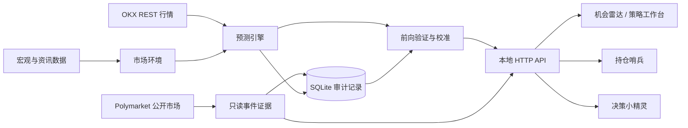

# QIS — OKX 半自动量化决策系统

[English](README.md) | [简体中文](README.zh-CN.md)

[](https://www.python.org/)
[](#测试)
[](#安全边界)
[](https://github.com/xietingwei/okx-semi-auto-quant/commits/main)

**QIS** 是一个本地优先、可解释的 OKX 现货与永续市场研究和短周期交易决策辅助系统。它将实时行情、多套短周期预测策略、前向验证、持仓级风险控制和可选的大模型决策小精灵整合在同一套工作流中。

系统默认运行在 **paper 模式**：分析行情并记录决策，但不会自动操作真实资金。

> **免责声明：** 本项目仅用于研究和工程实践，不构成任何投资建议。数字货币和杠杆产品可能在短时间内造成重大损失。

## 为什么选择 QIS？

许多交易系统只展示一个信号，却没有说明信号如何产生。QIS 会保留完整的决策链：

```text
实时市场数据
  → 趋势、动量与波动率特征
  → 市场微观结构与全局环境
  → 多套独立策略预测
  → 历史校准与模型健康检查
  → 机会评分与策略准入
  → 人工决策与持仓监控
```

QIS 围绕四项原则设计：

- **可解释：** 每次预测都包含影响因子、上涨概率、目标价、预测区间、失效位和适用策略。
- **风险优先：** 低评分、验证不足、行情过期或不利市场环境都会降低或阻止交易准入。
- **可审计：** 系统按小时冻结预测，并在预测周期到期后与真实价格比较。
- **人工决策：** 系统负责提供依据和风险建议，最终决策与执行仍由用户完成。

## 核心能力

| 能力 | 说明 |
| --- | --- |
| 机会雷达 | 使用经过校准的短周期预测，对加密货币、外部美股日线和可选 OKX 股票映射标的进行排序 |
| 策略工作台 | 对比综合自适应、趋势跟随、突破确认和均值回归策略 |
| 实时价格预测 | 基于 OKX 最新成交价重新计算特征、概率、收益和目标价 |
| 市场环境 | 综合盘口深度、资金费率、持仓量、成交量结构、宏观数据和市场广度 |
| Polymarket 事件情报 | 展示未来 1–14 天合格事件的真实概率、24 小时变化、价差、流动性和结算时间，且只作为只读影子证据 |
| 深度分析 | 数据源历史足够时基于最多 180 根日 K，逐日结合量化事实和外部消息生成原因推测，经过后续走势验证后汇总为超级大脑模式库 |
| 全标深度排名 | 按核心命中率、样本深度和可推演状态对全部标的排序，识别当前预测结构最可靠的标 |
| 神经网络影子大脑 | 以影子模式运行无外部依赖的小型神经学习器，按验证优势排序，但不替代交易建议 |
| 持仓哨兵 | 为手动登记的持仓提供动态止损、利润保护、减仓和退出时机建议 |
| 持续评估 | 统计方向命中率、MAE、系统性偏差、Brier 分数和区间覆盖率 |
| 决策小精灵 | 通过任意 OpenAI 兼容接口流式输出结合系统上下文的决策分析 |
| 本地优先 | 运行数据保存在本地 SQLite，并通过本地 Web 应用提供交互界面 |

## 策略体系

不同策略使用同一组市场数据，但对应不同的交易假设。

| 策略 | 主要周期 | 方向逻辑 | 适用环境 | 主要风险 |
| --- | --- | --- | --- | --- |
| 综合自适应 | 1–14 天 | 以 3 天和 7 天为主，并结合盘口、量能与市场环境 | 混合行情或环境切换期 | 极端冲击下多个因子同时失效 |
| 趋势跟随 | 3–14 天 | 沿 7/14/30 日局部趋势跟随 | 短线单边趋势和回撤后续涨 | 震荡行情反复止损 |
| 突破确认 | 1–7 天 | 结合成交量、盘口和持仓确认动量突破 | 盘整后的波动扩张 | 假突破 |
| 均值回归 | 1–7 天 | 对统计意义上的过度偏离进行反向交易 | 区间震荡和冲击后修复 | 强趋势中逆势接刀 |

新策略使用独立模型版本和独立评估记录。在积累足够的策略专属到期样本前，系统会将其标记为 **模拟观察**，不能直接给出生产级入场建议。

### 短期预测边界与参考质量

系统现在只输出四个可验证的短周期：**1 天、3 天、7 天、14 天**。其中 3 天是主要决策周期，7 天用于方向确认，1 天用于执行节奏，14 天只做风险观察。系统不再生成 1 个月、3 个月或 6 个月的点预测，避免把长期外推误当成交易依据。

预测必须同时通过两道闸门才会进入机会雷达：

- 数据质量：去重、时间排序、缺口、重复、陈旧度和样本覆盖率必须达标；质量不足会显示为“历史数据质量不足，观望”，机会分最高 39 分。
- 样本外验证：3 天与 7 天的独立验证窗口、方向命中率和相对基准优势必须达标；未达标只显示“仅观察/等待确认”。

历史校准按“标的 + 模型版本”完全隔离：BTC 的结果不能压缩 ETH，美股样本也不能校准加密货币；实时行情刷新会从保存的模型原始输出重新校准，不会对已校准结果再次压缩。如果某个标的没有超过自身的简单基准，或者校准后变动低于对应周期的短线噪声阈值，界面会明确显示 **暂无有效方向**，并改为展示一倍标准差的常态波动区间，不再把很小的收缩值包装成有参考价值的点预测。

K 线的 **1D、1M、3M、6M、1Y、ALL** 是历史查看窗口，不是预测周期。加密货币支持 5m/1H/2H/4H/12H/1D 等真实 OKX 周期，并自动合并实时与分页历史数据；外部美股数据源只有日线，界面不会把日线伪装成小时线。

Polymarket 被接入为独立的 **事件证据层**。系统只读取未来 14 天内结算的公开市场，并要求盘口完整、流动性和 24 小时成交量达标、价差不过宽、概率尚未接近结算。标的详情只展示直接点名该资产的事件或具有明确映射的行业事件；没有专属事件就显示“暂无标的专属事件”，不会使用全局宏观或地缘事件补位。合格观察仍可按小时保存用于影子验证，但不会修改预测、生成额外机会分或触发交易。

## 预测输入

当前模型体系综合使用：

- OKX 最新成交价；
- Yahoo Finance 美股日线（用于 `QIS_US_STOCK_SYMBOLS`，界面会注明交易市场和可用美股券商）；
- 30/90 日对数价格趋势；
- 7/30/90 日动量；
- 60 日实现波动率与 ATR；
- 20 档盘口不平衡和买卖价差；
- 永续合约资金费率拥挤度；
- 结合价格方向解释的持仓量变化；
- 近期主动成交量结构和成交参与度；
- SPY、QQQ、美元代理、VIX 和美国十年期国债收益率；
- 加密市场涨跌广度、30 日趋势广度、BTC 趋势锚、市场波动和流动性参与度。

所有辅助因子均有边界限制。它们只调整信号强度，不能施加不受限制的全市场偏置，也不能悄悄反转所有标的的原始方向。

## 决策规则

机会分和策略标签由同一套后端逻辑生成，并在实时价格重算和历史校准后同步更新。

| 机会分 | 最高策略状态 |
| ---: | --- |
| 70–100 | 只有当概率、置信度、验证和市场环境同时达标时，才可考虑入场 |
| 60–69 | 等待明确触发条件 |
| 45–59 | 中性观察 |
| 0–44 | 等待趋势企稳 |

当市场处于风险收缩环境时，即使单标的信号较强，也会降级为 **需要逆势确认**，不会作为普通入场候选展示。

## 系统架构



## 快速开始

### 环境要求

- Python 3.10 或更高版本
- macOS 或 Linux Shell 环境
- 能够访问 OKX 公共行情接口
- 可选：用于私有账户检查或执行的 OKX API 凭证
- 可选：用于决策小精灵的 OpenAI 兼容大模型 API Key

### 本地运行

```bash
git clone https://github.com/xietingwei/okx-semi-auto-quant.git
cd okx-semi-auto-quant

cp .env.example .env
bash scripts/start.sh
```

浏览器访问：

```text
http://127.0.0.1:8787/
```

查看或停止服务：

```bash
bash scripts/status.sh
bash scripts/stop.sh
```

公共行情分析不需要 OKX 私有凭证。首次运行建议保留最安全的默认配置：

```ini
OKX_SIMULATED=1
QIS_MODE=paper
```

## 配置

系统从 `.env` 读取配置。请勿提交该文件。

### OKX

```ini
OKX_API_KEY=
OKX_API_SECRET=
OKX_API_PASSPHRASE=
OKX_SIMULATED=1

QIS_MODE=paper
QIS_SPOT_AUTO_DISCOVER=1
QIS_SPOT_MAX_ASSETS=60
```

### Polymarket 事件证据

无需钱包或 API Key。该集成只读取公开市场数据，并与预测和执行路径保持隔离。

```ini
QIS_POLYMARKET_ENABLED=1
QIS_POLYMARKET_HORIZON_DAYS=14
QIS_POLYMARKET_MAX_EVENTS=5
QIS_POLYMARKET_MIN_LIQUIDITY=25000
QIS_POLYMARKET_MIN_VOLUME_24H=10000
QIS_POLYMARKET_MAX_SPREAD=0.05
```

### 风控参数

```ini
QIS_RISK_PER_TRADE=0.0075
QIS_DAILY_LOSS_LIMIT=0.025
QIS_MAX_DRAWDOWN=0.12
QIS_MAX_LEVERAGE=2
QIS_MAX_NOTIONAL_PCT=0.35
QIS_MAX_TRADES_PER_DAY=6
```

### 可选的大模型决策小精灵

QIS 使用 OpenAI 兼容的 `/chat/completions` 接口。大模型底座可以替换，并且不参与数值预测的生成。

```ini
LLM_PROVIDER=DeepSeek
LLM_API_KEY=
LLM_BASE_URL=https://api.deepseek.com
LLM_MODEL=deepseek-v4-flash
LLM_TIMEOUT_SECONDS=45
```

如果大模型不可用，行情预测、历史评估和风险管理功能仍可正常运行。

### 机会分邮件提醒

当任一策略的机会分达到配置阈值时，QIS 可以发送一封聚合提醒邮件。系统按“标的 + 策略”去重，并设置可配置的冷却时间，避免每轮刷新重复通知。Gmail 必须使用应用专用密码。

```ini
QIS_EMAIL_ALERT_ENABLED=1
QIS_EMAIL_ALERT_RECIPIENTS=xietingwei.731@gmail.com
QIS_EMAIL_ALERT_SCORE_THRESHOLD=85
QIS_EMAIL_ALERT_COOLDOWN_HOURS=12
QIS_EMAIL_SMTP_HOST=smtp.gmail.com
QIS_EMAIL_SMTP_PORT=465
QIS_EMAIL_SMTP_USERNAME=你的Gmail账号
QIS_EMAIL_SMTP_PASSWORD=你的应用专用密码
QIS_EMAIL_SMTP_FROM=你的Gmail账号
QIS_EMAIL_SMTP_USE_SSL=1
```

邮件凭证只应保存在 `.env` 中。邮件发送失败不会中断预测生成或看盘页面刷新。

## 命令行

```bash
# 运行系统检查
python3 -m qis doctor

# 输出机会排行
python3 -m qis analyze --top 10

# 同时显示未达到默认概率门槛的候选
python3 -m qis analyze --top 10 --show-all

# 回测当前配置的策略
python3 -m qis backtest --limit 300

# 查看最近计划
python3 -m qis status

# 紧急暂停 / 恢复
python3 -m qis pause
python3 -m qis resume
```

记录一笔手动执行的交易结果：

```bash
python3 -m qis trade-add \
  --inst ETH-USDT-SWAP \
  --side buy \
  --entry 1802 \
  --exit 1820 \
  --size 0.1 \
  --stop 1790 \
  --tp 1829 \
  --prob 0.49 \
  --model manual-research \
  --notes "manual breakout"
```

## 持续学习

QIS 按小时为每个模型版本和预测周期冻结快照。预测到期后，系统记录真实收益并更新：

- 方向命中率；
- 平均绝对收益误差；
- 系统性偏差；
- Brier 概率分数；
- 预测区间覆盖率。

校准采用近期样本权重更高、带边界约束的收缩方法，并按标的与模型版本隔离。它可以降低置信度或将预测拉回中性，但不能借用其他标的的历史结果、反转原始方向，也不能在实时行情刷新时重复应用。

模型升级和策略变体使用独立版本标识，防止旧算法的误差悄悄污染新算法。

## 安全边界

- 默认模式为 `paper`。
- Web 应用不会自动下单。
- 大模型不能下单，也不能绕过数值风控。
- 存在 `data/PAUSE` 文件时，交易循环停止。
- 运行数据库、日志、缓存、凭证和生成的报表不会进入 Git。
- 私有 API 凭证应使用最小权限，绝不能开启提币权限。
- 回测结果和历史命中率不代表未来表现。

考虑实盘前，请执行：

```bash
python3 -m qis doctor
python3 -m pytest -q
```

配置凭证前请阅读 [SECURITY.md](SECURITY.md)。

## 项目结构

```text
qis/
├── spot_forecast.py      短周期策略预测引擎
├── short_term.py         短周期数据质量与参考闸门
├── deep_analysis.py      每日推测验证与超级大脑
├── market_factors.py     市场微观结构与全局环境
├── forecast_learning.py  有边界的历史校准
├── position_risk.py      持仓止损与退出建议
├── decision_assistant.py 可选的大模型决策上下文
├── storage.py            SQLite 审计与评估存储
├── web_server.py         本地 HTTP 与流式 API
├── spot_dashboard.py     本地决策终端
├── risk.py               仓位和组合风险控制
├── backtest.py           历史模拟
└── okx.py                OKX REST 客户端

scripts/                  启动、停止和状态脚本
tests/                    单元测试与回归测试
```

## 测试

```bash
python3 -m pytest -q
python3 -m compileall -q qis tests
git diff --check
```

当前测试覆盖预测、策略隔离、实时价格重算、市场因子、历史校准、Polymarket 质量闸门与标的映射、数据存储、持仓退出、API 行为和大模型上下文构建。

## 参与贡献

欢迎提交 Issue 和 Pull Request。开始前请阅读 [CONTRIBUTING.md](CONTRIBUTING.md)。

影响较大的改动应包括：

- 清晰的交易假设；
- 有边界的下行风险；
- 方向与校准稳定性测试；
- 不引入未来数据泄漏的证据；
- 策略预期失效环境的说明。

## 安全问题

请勿在公开 Issue 中提交凭证、账户标识、私有持仓或漏洞细节。私密报告方式请参阅 [SECURITY.md](SECURITY.md)。

## 许可证

本仓库目前尚未授予开源许可证。代码可以公开查看，但在未来添加许可证之前，所有权利均予保留。

## 致谢

- [OKX API](https://www.okx.com/docs-v5/en/)
- [scikit-learn TimeSeriesSplit](https://scikit-learn.org/stable/modules/generated/sklearn.model_selection.TimeSeriesSplit.html)
- [scikit-learn 概率校准](https://scikit-learn.org/stable/modules/calibration.html)
- [River 漂移检测](https://riverml.xyz/latest/api/drift/ADWIN/)
