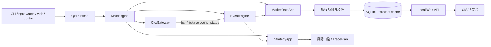

# QIS 的 vn.py 风格架构

QIS 采用 [vn.py 官方仓库](https://github.com/vnpy/vnpy) 的核心设计思想重构，
但不直接依赖完整的 `vnpy` Python 包。官方包同时包含 PySide6、TA-Lib、
pyqtgraph 等桌面量化工作站依赖；QIS 是本地 Web 决策系统，直接安装会把 Qt
界面和大量当前不需要的科学计算依赖带入服务进程。

本次重构保留了 vn.py 最关键且与 QIS 匹配的架构契约：

- `EventEngine`：事件队列、分类订阅、全局订阅和定时事件；
- `MainEngine`：统一管理网关、功能引擎和完整生命周期；
- `BaseGateway`：隔离交易所/数据源协议，输出统一领域事件；
- `BaseApp` / `BaseEngine`：策略、行情、预测、风控等能力可独立安装；
- typed data objects：事件边界使用不可变的数据对象，而不是散乱字典。

这些概念对应 vn.py 官方的
[`vnpy.event`](https://github.com/vnpy/vnpy/tree/master/vnpy/event)、
[`MainEngine`](https://github.com/vnpy/vnpy/blob/master/vnpy/trader/engine.py)、
[`BaseGateway`](https://github.com/vnpy/vnpy/blob/master/vnpy/trader/gateway.py) 和
[`BaseApp`](https://github.com/vnpy/vnpy/blob/master/vnpy/trader/app.py)。vn.py 4.x
也把网关和应用拆成独立包，QIS 因此保持“小内核 + 可插拔模块”的方向。

## 当前运行结构

## 代码映射

| vn.py 概念 | QIS 实现 | 当前职责 |
| --- | --- | --- |
| Event / EventEngine | `qis/event/` | 异步分发事件；隔离单个处理器异常；支持定时事件 |
| MainEngine / BaseEngine | `qis/trader/engine.py` | 注册、查找、启动和关闭网关及应用引擎 |
| BaseGateway | `qis/trader/gateway.py` | 定义数据源适配器契约和标准回调 |
| OKX gateway | `qis/gateway/okx_gateway.py` | 封装原 OKX REST 客户端并发布 K 线、Ticker、账户和状态事件 |
| Market data app | `qis/app/market_data.py` | 统一历史查询并维护进程内 K 线缓存 |
| Strategy app | `qis/app/strategy.py` | 隔离 Donchian 信号与风险计划，发布 signal / trade-plan 事件 |
| Composition root | `qis/runtime.py` | 按配置组装可关闭的完整运行时 |
| Data objects | `qis/trader/object.py` | `HistoryRequest`、`BarBatchData`、`GatewayStatusData` 等稳定 DTO |

## 已迁移流程

- `spot-dashboard` / `spot-watch`：发现标的、拉取历史 K 线和市场微观数据均走
  `OkxGateway`；批量 K 线查询走 `MarketDataApp`。
- `run` / `scan`：`Runner` 只负责编排和人工确认；信号与风控计划由
  `StrategyApp` 生成。
- `backtest` / `analyze`：历史行情统一通过行情应用查询。
- `web`：实时 Ticker 和专业 K 线接口复用常驻 OKX 网关，服务关闭时统一释放。
- `doctor`：公共行情、合约和私有账户检查使用同一运行时，不再另建协议客户端。

原 CLI 命令、SQLite 数据、页面接口和模型输出保持兼容。Web UI 仍然只允许手工
登记持仓；`QIS_MODE=paper` 和 `OKX_SIMULATED=1` 仍是默认值。框架重构不会绕过
已有的人工 `EXECUTE` 确认，更不会因为事件总线而自动下单。

## 后续模块边界

以下拆分应沿用同一契约逐步完成，避免再次形成单文件流水线：

1. 把 Yahoo Finance 与 Polymarket 变成独立只读网关；没有资产事件时继续返回空，
   不做跨标的补齐。
2. 把短线预测、walk-forward 校准和影子模型拆成 `ForecastApp`、
   `EvaluationApp`，由冻结的预测快照事件连接。
3. 为实时 WebSocket 行情增加订阅请求与断线重连，同时保留 REST 历史补洞。
4. 建立统一数据记录器，让实盘/纸面运行与回测消费相同的 Bar/Signal/Plan 对象。
5. 只有在用户明确授权后，才增加订单管理应用；默认系统继续停留在分析与人工执行。

架构目标不是照搬 vn.py 的 Qt 交易终端，而是让 QIS 获得同样清晰的事件驱动、
网关隔离和应用生命周期，同时保留当前 Web 产品形态。
